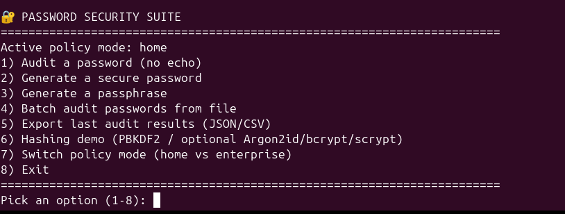

# Password Security Suite (Local Password Awareness Toolkit)

A locally hosted, defensive password auditing toolkit built for one reason: **user awareness**.

In many organisations, staff still use passwords that are painfully predictable — seasons + year, keyboard runs, repeats, common words, or tiny tweaks of the same password everywhere. Policies alone don’t change habits. People need a **safe, private way to check a password locally** and understand *why* it’s risky.

This suite gives users a quick self-check tool they can run on their own machine, get a clear risk result, and leave with better options (secure password/passphrase generation). It’s designed to support awareness and better choices — not to shame anyone.

---

## What this tool is (and isn’t)

### ✅ What it is
- A **local** password auditor (runs offline)
- A **teaching tool**: flags risky patterns, shows a simple breakdown, and recommends improvements
- A **generator** for secure passwords and passphrases
- A **batch auditor** (for testing a list of *dummy* or approved samples)
- A **hashing demo** (PBKDF2 always works; Argon2id/bcrypt optional; scrypt included)
- Exports results to **JSON/CSV** for reporting and awareness sessions (without storing plaintext passwords)

### ❌ What it is not
- Not a cracking tool
- Not a scanner
- Not a way to test other people’s passwords
- Not a compliance certificate

---

## Key features

### 1) Password audit with structured results (dict / JSON)
- Returns a structured result with:
  - length, entropy estimate, overall score (0–100), risk label
  - patterns detected (sequences, repeats, keyboard runs, common words)
  - optional local breached/common-list checks
  - clear recommendations

### 2) Score breakdown that users actually understand
Every audit shows a simple bar breakdown:
- **Length** (based on policy mode targets)
- **Uniqueness** (common/breached list signals, if provided)
- **Patterns** (predictable structures that reduce real strength)

### 3) Policy modes (home vs enterprise)
Two presets to match typical expectations:
- **Home mode**: min 12, prefer 16, normal offline attacker assumption
- **Enterprise mode**: min 14, prefer 20, stronger offline attacker assumption

This is meant to guide better choices, not to claim a specific standard.

### 4) Secure generators
- Secure random passwords (using `secrets`)
- Passphrases that are easier to type and remember

### 5) Logging (privacy-first)
Logs actions like “audit run” or “export created” **without logging plaintext passwords**.

### 6) Exports
- `exports/audit_results.json`
- `exports/audit_results.csv`

Exported results contain audit metrics and findings — not the original password.

---

## Why I built this

This project came out of a real-world problem: **the absurdity of passwords used by staff** and the risk it creates.

Users weren’t malicious — they were busy. Many didn’t know what “strong” really means today. A proactive approach was needed: something local, quick, and simple enough that a user would actually run it.

So I built a tool that:
- stays offline
- explains risk plainly
- shows users *what to fix*
- gives them safer alternatives immediately

---

## What I learned while building it

I didn’t just code — I had to understand what “strong” means in practical terms.

### Entropy (and the reality behind it)
- Entropy is a useful **estimate** of password search space.
- But entropy can be misleading when a password is built from predictable patterns.
- That’s why this tool combines entropy estimation with pattern detection.

### Password patterns matter more than people think
A password can look “complex” but still be predictable:
- keyboard runs (`qwerty`, `asdfgh`)
- sequences (`12345`, `abcd`)
- repeats (`aaaa`, `abab`)
- common word + year (`Summer2025!`)

Those patterns are common because humans create them naturally — and that’s exactly why they’re risky.

### Length and uniqueness dominate
- Longer passwords/passphrases tend to hold up better.
- Password reuse is a huge practical risk — uniqueness matters.

---

## Installation

No external dependencies are required for core functionality.

Optional hashing demos:
- Argon2id: `pip install argon2-cffi`
- bcrypt: `pip install bcrypt`

---
## Screenshots

### Interface (Options)


### Audit output (score breakdown + findings)


## Quick start (Interactive menu)

```bash
python3 run_suite.py


